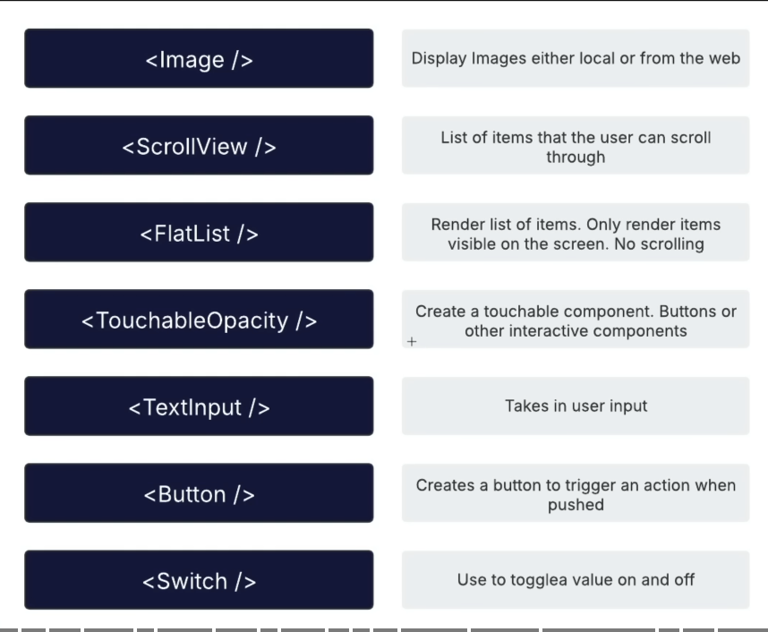

# Welcome to your Expo app 👋

This is an [Expo](https://expo.dev) project created with [`create-expo-app`](https://www.npmjs.com/package/create-expo-app).

## Get started

1. Install dependencies

   ```bash
   npm install
   ```

2. Start the app

   ```bash
   npx expo start
   ```

In the output, you'll find options to open the app in a

- [development build](https://docs.expo.dev/develop/development-builds/introduction/)
- [Android emulator](https://docs.expo.dev/workflow/android-studio-emulator/)
- [iOS simulator](https://docs.expo.dev/workflow/ios-simulator/)
- [Expo Go](https://expo.dev/go), a limited sandbox for trying out app development with Expo

You can start developing by editing the files inside the **app** directory. This project uses [file-based routing](https://docs.expo.dev/router/introduction).

## Get a fresh project

When you're ready, run:

```bash
npm run reset-project
```

This command will move the starter code to the **app-example** directory and create a blank **app** directory where you can start developing.

## Learn more

To learn more about developing your project with Expo, look at the following resources:

- [Expo documentation](https://docs.expo.dev/): Learn fundamentals, or go into advanced topics with our [guides](https://docs.expo.dev/guides).
- [Learn Expo tutorial](https://docs.expo.dev/tutorial/introduction/): Follow a step-by-step tutorial where you'll create a project that runs on Android, iOS, and the web.

## Join the community

Join our community of developers creating universal apps.

- [Expo on GitHub](https://github.com/expo/expo): View our open source platform and contribute.
- [Discord community](https://chat.expo.dev): Chat with Expo users and ask questions.

# ALl Notes

## 1. Reset the project boiletplate

`npm run reset-project`

## 2. React Native Components

Text = para, heading etc
View = container

`<Image />` => Display images either local or from web
`<ScrollView />` => List of items user can scroll
`<FlatList />` => Render list of items. Only render items visible on the screen. No scrolling
`<TouchableOpacity />` => Toucable component. Button etc
`<TextInput />` => Take in user input
`<Button />` => Create a button to trigger an action when pushed
`<Switch />` => Use a toggle value on and off



## File based routing

## Styling

1. import stylesheet `import { StyleSheet } from "react-native";`

2.

```ts
<View style={styles.container}>
  <Text>Edit app/index.tsx to edit this screen.</Text>
</View>;

const styles = StyleSheet.create({
  container: {
    flex: 1,
    justifyContent: "center",
    alignItems: "center",
  },
});
```

3.  Rename index to HomeScreen

## Layout, Stack & Slot Components

#### Root Layout

- `_layout.jsx`

#### `<Stack />`

- Stack on top of another and will have back functionality

#### `<Slot>`

- Header is gone

## Customize Page Header

```ts
<Stack
  screenOptions={{
    headerStyle: {
      backgroundColor: "#ff8c00",
    },
    headerTintColor: "#fff",
    headerTitleStyle: {
      fontSize: 20,
      fontWeight: "bold",
    },
    contentStyle: {
      paddingHorizontal: 10,
      paddingTop: 10,
      backgroundColor: "#fff",
    },
  }}
>
  <Stack.Screen name="index" options={{ title: "Home" }} />
</Stack>
```

## Home Screen

- To show image import `Image`

```ts
import PostItImage from "@/assets/images/post-it.png";
import { useRouter } from "expo-router";

const router = useRouter();

<View style={styles.container}>
  <Image source={PostItImage} style={styles.image} />
  <Text style={styles.title}>Welcome to Notes App</Text>
  <Text style={styles.subtitle}>Capture your thoughts anythime, anywhere</Text>
  <TouchableOpacity style={styles.button} onPress={() => router.push("/notes")}>
    <Text style={styles.buttonText}>Get Started</Text>
  </TouchableOpacity>
</View>;
```

## Notes Layout & Screen
1. create new folder `notes` --> create `_layout.jsx & index.jsx`

```ts
import { Stack } from "expo-router";

const NoteLayout = () => {
  return <Stack />;
};

export default NoteLayout;
```


```ts
import { StyleSheet, Text, View } from "react-native";

const NoteScreen = () => {
  return (
    <View style={styles.container}>
      <Text>Notes</Text>
    </View>
  );
};

const styles = StyleSheet.create({
  container: {
    flex: 1,
    padding: 20,
    backgroundColor: "#fff",
  },
});

export default NoteScreen;
```

## Display Notes In FlatList

```ts


```